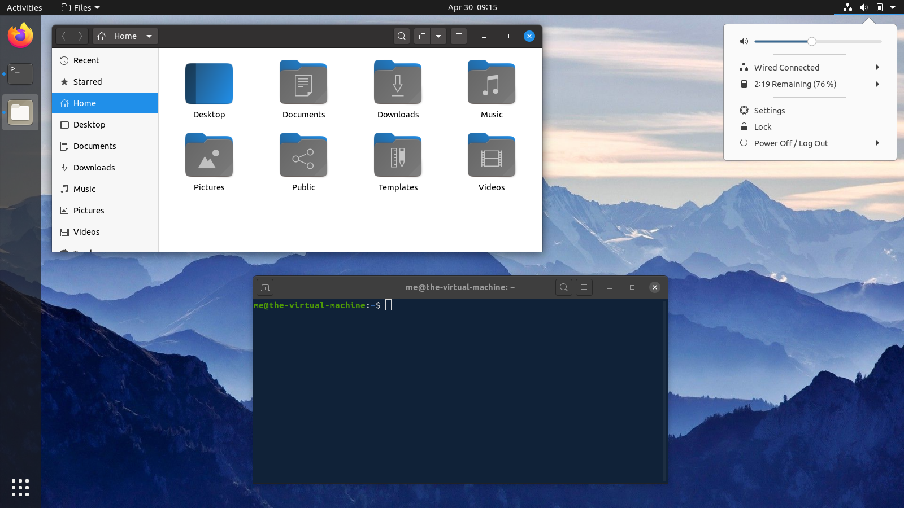
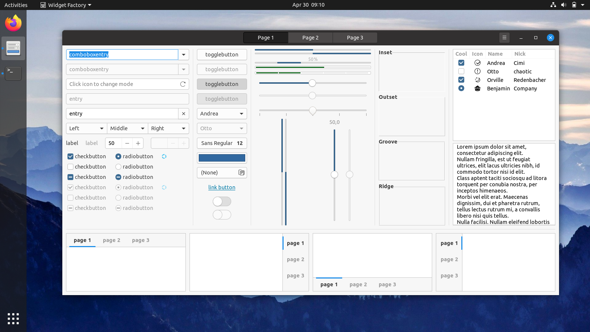
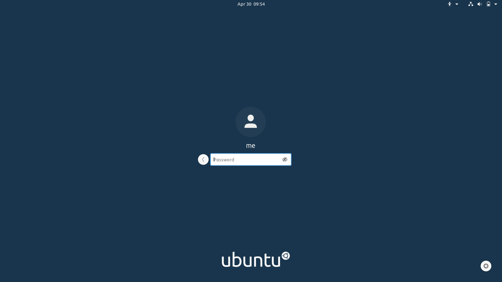

# Yaru-Anycolor

This repository contains a script that modifies [Ubuntu's Yaru Theme](https://github.com/ubuntu/yaru) to use colors of your choice. The idea for this project came from using the [Yaru-Colors](https://github.com/Jannomag/Yaru-Colors) project.

Tested on Ubuntu 20.04 (Gnome 3.36.1).

## Example

The following screenshots show the YaruBlue-Theme I'm currently using:







## Preparations

Install dependencies needed to build yaru (for more details, see yaru's [CONTRIBUTING.md](https://github.com/ubuntu/yaru/blob/master/CONTRIBUTING.md)):

```
sudo apt install libgtk-3-dev git meson sassc inkscape optipng ruby
```

Clone this repository and initialize the yaru submodule:

```
git clone https://github.com/fkohlgrueber/yaru-anycolor.git --recurse-submodules
cd yaru-anycolor
```

## Configuration

Open the `color_theme.py` file and edit the constants at the top to suit your needs. The default values are as follows:

```
THEME_NAME = "YaruBlue"
COLOR_BRIGHT = "#208fe9"       # orange in yaru
COLOR_MID = "#3c6b93"          # aubergine in yaru
COLOR_DARK = "#255074"         # purple in yaru
BG_COLOR_TERMINAL = "#0e1d30"
```

## Apply colors to the yaru submodule

Execute the `color_theme.py` script. This will update colors in various places, including some icons.

```
python3 color_theme.py
```

You can use `git diff` in the submodule folder to see what values were updated by the script.

## Build the theme

Build the theme just like the original yaru theme is built (for more details, see yaru's [CONTRIBUTING.md](https://github.com/ubuntu/yaru/blob/master/CONTRIBUTING.md)):

```
cd yaru
meson build -D gnome-shell-gresource=true
cd build
sudo ninja install
```

## Select the theme

The theme can now be selected, either using the Gnome Tweaks GUI or by using the following commands:

```
gsettings set org.gnome.desktop.interface gtk-theme <YOUR_THEME_NAME>
gsettings set org.gnome.desktop.interface icon-theme <YOUR_THEME_NAME>
```

If you want your login screen to use the modified theme, use the following commands:

```
sudo update-alternatives --install /usr/share/gnome-shell/gdm3-theme.gresource gdm3-theme.gresource /usr/share/gnome-shell/theme/<YOUR_THEME_NAME>/gnome-shell-theme.gresource 15
sudo update-alternatives --config gdm3-theme.gresource
```

When asked which alternative to use, select the modified theme. You can use this command to switch back to the default yaru theme later if desired.

Reboot.

On the login screen, click on the gear icon in the lower right corner, select your theme and log in.

That's it! You should now have the new theme applied to applications, the gnome-shell (dock etc.) and the login screen.

Feel free to open an issue if things don't work as expected.